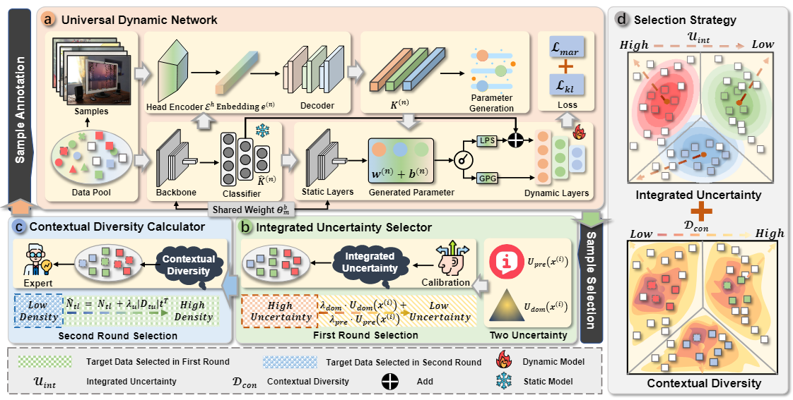

# Detective: A <u>D</u>ynamic Int<u>e</u>gra<u>te</u>d Un<u>c</u>er<u>t</u>a<u>i</u>nty <u>V</u>aluation Fram<u>e</u>work

## About

This repository contains **code for our accepted CVPR 2024 [paper](https://arxiv.org/abs/2311.12905)**:

> **"Revisiting the Domain Shift and Sample Uncertainty in Multi-source Active Domain Transfer"**.

## Abstract

Active Domain Adaptation (ADA) aims to maximally boost model adaptation in a new target domain by actively selecting a limited number of target data to annotate. This setting neglects the more practical scenario where training data are collected from multiple sources. This motivates us to target a new and challenging setting of knowledge transfer that extends ADA from a single source domain to multiple source domains, termed Multi-source Active Domain Adaptation (MADA). Not surprisingly, we find that most traditional ADA methods cannot work directly in such a setting, mainly due to the excessive domain gap introduced by all the source domains and thus their uncertainty-aware sample selection can easily become miscalibrated under the multi-domain shifts. Considering this,  we propose a **D**ynamic int**e**gra**te**d un**c**er**t**a**i**nty **v**aluation fram**e**work (**Detective**) that comprehensively consider the domain shift between multi-source domains and target domain to detect the informative target samples. Specifically, the Detective leverages a dynamic Domain Adaptation (DA) model that learns how to adapt the model's parameters to fit the union of multi-source domains. This enables an approximate single-source domain modeling by the dynamic model. We then comprehensively measure both domain uncertainty and predictive uncertainty in the target domain to detect informative target samples using evidential deep learning, thereby mitigating uncertainty miscalibration. Furthermore, we introduce a contextual diversity-aware calculator to enhance the diversity of the selected samples. Experiments demonstrate that our solution outperforms existing methods by a considerable margin on three domain adaptation benchmarks.



## Run the Code

### Environment

* Python==3.10
* Pytorch==2.1.0
* numpy==1.26.1
* Pillow==10.1.0
* sympy==1.12
* urlib3==2.0.7
* yacs==0.1.8

### Dataset Preparation

* Download [Office-Home Dataset](https://www.hemanthdv.org/officeHomeDataset.html)
* Download [DomainNet Dataset](https://ai.bu.edu/M3SDA/#dataset) and [miniDomainNet splits](https://drive.google.com/file/d/15rrLDCrzyi6ZY-1vJar3u7plgLe4COL7/view)

### Training

You need to edit the configurations in the `./configs/<dataset_name>.yaml` file that corresponding to certain dataset:

```yaml
<dataset_name>.yaml
├── OUTPUT_DIR
├── INPUT
│   ├── SIZE
│   ├── CROP_SIZE
│   ├── SOURCE_TRANSFORMS
│   ├── TARGET_TRANSFORMS
│   ├── TEST_TRANSFORMS
├── DATASET
│   ├── ROOT
│   ├── NAME
│   ├── SOURCE_DOMAINS
│   ├── TARGET_DOMAINS
│   ├── NUM_CLASS
├── DATALOADER
│   ├── SOURCE
│   │   └── BATCH_SIZE
│   ├── TARGET
│   │   └── BATCH_SIZE
│   ├── TEST
│   │   └── BATCH_SIZE
├── TRAIN
│   ├── PRINT_FREQ
├── OPTIM
│   ├── NAME
│   ├── LR
├── TRAINER
│   ├── NAME
│   ├── MAX_EPOCHS
│   ├── CLIP_GRAD_NORM
├── NETWORK
│   ├── Z_DIM
├── SEED
├── GPU_ID
```

Then run following command:

`sh <dataset_name>_train.sh`

## Referencing and Citing 

If you find our work useful in your research and would like to cite our project, please use the following citation:

```latex
@inproceedings{zhang2024revisiting,
  title={Revisiting the domain shift and sample uncertainty in multi-source active domain transfer},
  author={Zhang, Wenqiao and Lv, Zheqi and Zhou, Hao and Liu, Jia-Wei and Li, Juncheng and Li, Mengze and Li, Yunfei and Zhang, Dongping and Zhuang, Yueting and Tang, Siliang},
  booktitle={Proceedings of the IEEE/CVF Conference on Computer Vision and Pattern Recognition},
  pages={16751--16761},
  year={2024}
}
```